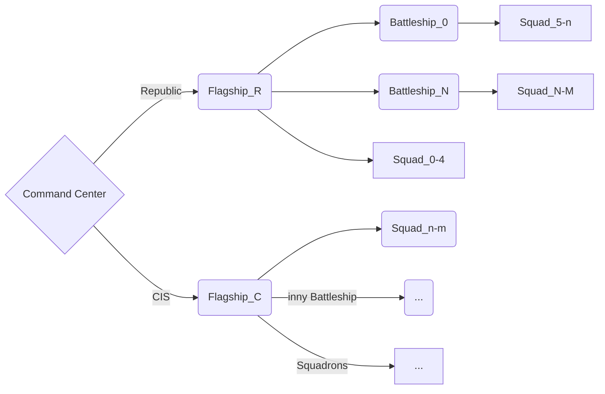

# Temat Własny - Bitwa Kosmiczna
W przestrzeni kosmicznej nad nieznanym księżycem toczy się bitwa floty **Republiki** i **CIS**. Każda z flot posiada rozmaite okręty i myśliwce próbujące się zniszczyć nawzajem. Stań się obserwatorem który będzie śledzić postęp tej potyczki, a morze nawet na nią wpłynąć.
## Opis
Jest to symulacja zainspirowana grą RTS "Empire at War" gzie zamiast trybu PvE (Player vs Environment) mamy tryb EvE gzie użytkownik będzie mógł wpłynąć na potyczkę w pewne sposoby.
### Główne Punkty 
- Podział n frakcje i jednostki, i ich statystyki
- Zachowania poszczególnych typów jednostek
- Hierarchia, limity, procesy i możliwe przyszłe update'y
- Testy do przeprowadzenia  
## Frakcje i jednostki
W pierwszych wersjach będą 2 zakodowane frakcje **Republika** i **CIS**, jak i 6 różnych typów jednostek
### Kategorie jednostek
| typ | podtyp | opis |
|--|--|--|
| **Flagship**| - | jedna jednostka na frakcje; tworzy własne myśliwce i koordynuje inne **okręty**.  |
| **Battleship** | Destroyer, Carrier | okręt średniej wielkości; tworzy własne myśliwce. |
| **Squadrons** | Fighters, Bombers, Elite Fighters | małe i szybkie jednostki. |

### Nazwy jednostek
| jednostka | Republika | CIS |
|--|--|--|
| **Flagship** | Venator-class Star Destroyer | Providence-class Dreadnought |
| **Destroyer** | Victory-class Star Destroyer | Recusant-class Light Destroyer |
| **Carrier ** | Acclamator-class Assault Ship | Munificent-class Star Frigate |
| **Fighters** | V-19 Torrent Starfighter | Vulture Droid |
| **Bombers** | Y-wing Starfighter | Hyena-class Droid Bomber |
| **Elite Fighters** | ARC-170 Starfighter | Droid Tri-Fighter |

### Specyfikacje jednostek
**Atrybuty**:
- hull integrity (HP) - integralność kadłuba, życie (nie odnawialne)
- Shields (SH) - osłony (odnawialne)
- Energy (EN) - energia (nieskończona dla **Flagship** i **Battleship**, skończone dla **Squadrons**)
- Speed (SP) - prędkość
- Size (SI) - rozmiar
- Detection Range (DR) - zasięg wykrywania
- Batteries - system broni (cannon/działa i guns/karabiny)

**Typy i priorytety broni**:
- gun - 75% celności, cele tylko **Squadrons**
- cannons - 75% celności dla **Flagship** i **Battleship**, 25% celności dla **Squadrons**

**Statystyki jednostek**:

| typ | HP | SH | EN | SP | SI | DR | Batteries |
|--|--|--|--|--|--|--|--|
| **Flagship** | high | high | inf | low | big | whole map | 4  [2 long range cannons, 2 mid range guns] |
| **Destroyer** | high | mid | inf | mid | mid | high | 3 [2 long range cannons, 1 mid range gun] |
| **Carrier** | mid | high | inf | mid | mid | mid | 3 [1 long range cannon, 2 mid range guns] |
| **Fighter** | low | none | fin | high | small | low-mid | 1 [1 short range gun] |
| **Bomber** | low | low | fin | mid-high | small | low-mid | 1 [1 short range cannon] |
| **Elite Fighter** | low | low | fin | very high | small | mid | 1 [1 short range gun] |

### Ustawienia jednostek
**Standardowe rozkazy**:
- **Attack** - atakuj cel, ignoruj przeciwników
- **Move** - przejdź do zaznaczonej pozycji, ignoruj przeciwników
- **Move Attack** - przejdź do zaznaczonej pozycji, jeśli przeciwnik napotkany atakuj zgodnie z priorytetem słabości
- **Guard** - **Move** blisko celu i atakuj wszystkich przeciwników w zasięgu celu zgodnie z priorytetem słabości
- **Patrol** - **Move Attack** do losowej pozycji na mapie z 75% **SP**

**Priorytet słabości**:
- **Flagship** +50% DMG → **Carrier**
- **Destroyer** +50% DMG → **Flagship**, **Destroyer**, **Carrier**
- **Carrier** +50% DMG → **Fighter**, **Fighter**, **Elite Fighter**
- **Fighter** +50% DMG → **Fighter** i **Bomber**
- **Bomber** +100% DMG → **Flagship**, **Destroyer**,**Carrier**
- **Elite Fighter** +50% DMG → **Fighter**, **Fighter**, **Elite Fighter**

**Osobowość Flagship**:
- **Passive**- okręt będzie  pasywny, zostanie w miejscu z dala od walk, jego **Squadrons** będą ciągle w stanie **Guard** z **Flagship** jako cel.
- **Active** - okręt będzie trzymał się z tyłu formacji ale będzie brał udział w potyczkach zapewniając wsparcie z daleka, jego myśliwce mogą brać aktywną role w walkach.
- **Aggressive** - okręt będzie na czele floty aktywnie brał udział w walkach, jego myśliwce będą ciągle aktywne

~~**Taktyki**~~:
TBA

### Zachowania jednostek
**DEFAULT** - jest to podstawowe zachowanie jednostki, oprócz **Flagship**, jeśli nie ma dowódcy.

**Flagship**
Jeśli na mapie każdy **Battleship** jest przypisany pod ten okręt.
Za jego zachowanie jest odpowiedzialna **Osobowość**.
Losowo lub na podstawie sytuacji okręt wydaje rozkazy z **Taktyki**.
Okręt jest w stanie widzieć całą mapę więc morze analizować sytuację na niej.
Przed zniszczeniem wysyła lokalizację najbliższego **Battleship** wszystkim **Squadrons** pod jego dowodzeniem.

**Battleship**
Jeśli pod dowodzeniem, wykonuje rozkazy **Flagship**.
Jeśli cel do ataku to wysyła rozkaz do **Bomber** do ataku, atakuję również swoimi **Batteries**, **Fighters** i **Elite Fighters** skupiają się na innych wrogich **Squadrons**
Przed zniszczeniem wysyła lokalizację najbliższego **Battleship** wszystkim **Squadrons** pod jego dowodzeniem.
Jeśli nie ma **Flagship** na mapie jego zachowanie jest DEFAULT, czyli wchodzi w stan **Patrol**. Jeśli napotka sojuszniczy **Battleship** jeden z nich zostaje **Lider**'em i się **Group**'ują. Każda jednostka w grupie dostosowywane się do prędkości najwolniejszej jednostki i podążają za liderem. Każdy statek w grupie dzieli **DR**. Jeśli wróg napotkany grupa zaczyna go atakować zgodnie z priorytetem słabości.

**Squadrons**
Jeśli pod dowodzeniem, wykonuje rozkazy dowódcy (**Flagship** lub **Battleship**)
Jeśli cel nie określony (Move Attack) atakuje przeciwnika zgodnie z priorytetem słabości.
Jeśli dowódca został zniszczony i przesłał ostatnie koordynaty najbliższego **Flagship** lub **Battleship**, przejdź tam i wejdź pod dowodzenie tego okrętu. Jeśli nie to przejdź w DEFAULT, czyli wejdź w Patrol. Jeśli napotka **Flagship** lub **Battleship** wejdź pod dowodzenie.

## Technikalia 
### Struktura Procesów
| typ procesu | rola | limit |
|--|--|--|
| **Command Center** proces| Inicjacja symulacji | 1 |
| **Flagship** proces| Zarządza flotą | max 1 na frakcję |
| **Battleship** proces| Destroyer/Carrier | w limicie |
| **Squadrons** proces| Fighters/Bombers/Elites | w limicie |

Zakodowany limit procesów: **64** (może się zmienić)

### Tworzenie **Squadrons**
- Flagship → 3 elite fighters + 2 bombers
- Destroyer → 1 bomber + 3 fighters
- Carrier → 3 bombers + 3 fighters

### Hierarchia procesów

### Mapa, Koordynaty, Kontrola
- 2D siatka jako mapa regionów
- pozycje (x,y) jednostkach w regionach, wykrywanie **DR** okrężne
- Kontrola: stop/play, kontrola prędkości, przyzywanie jednostek  
### Kolejki i Pamięć dzielona
Do popracowania z tym ale może byłoby możliwe utworzenie osobnych kolejek na frakcję co zsynchronizowało by jednostki pomiędzy frakcjami dzięki czemu wprowadzona by została lekka losowość np. który ze statków dokona decydującego strzału. Jednostki w tej samej frakcji były by zsynchronizowane.

### Możliwe update'y
- Wątki jako systemy okrętów np. silniki, działo, karabin, tarcze, hangar itp. możliwe ich zniszczenie
- Zwiększenie ilości frakcji.
- Większy wpływ użytkownika na symulację.

## Testowe scenariusze
- Bitwa z tymi samymi jednostkami po obu stronach
- Zniszczenie **Flagship**
- Zniszczenie statku rodzica (dla **Squadrons**) 
- Synchronizacja i de synchronizacja
- Carrier vs Destroyer
- No conflict simulation

